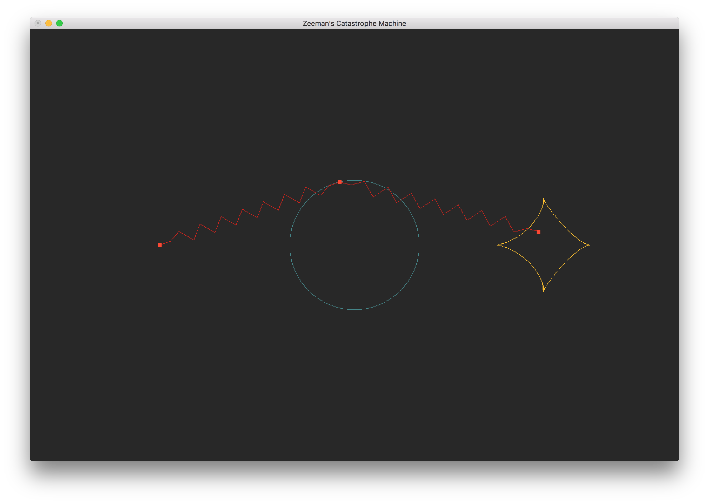
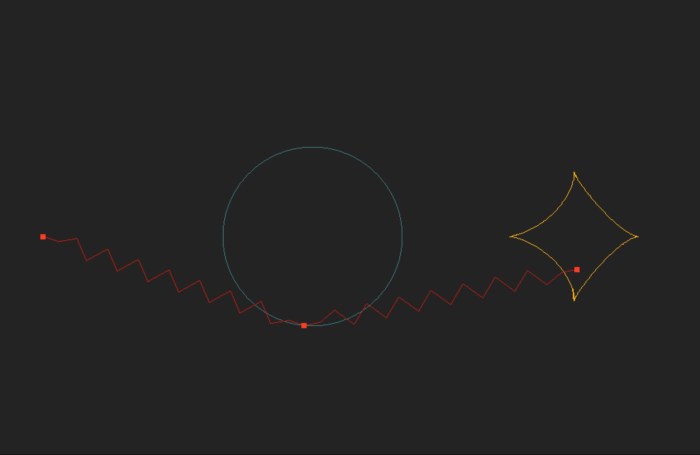
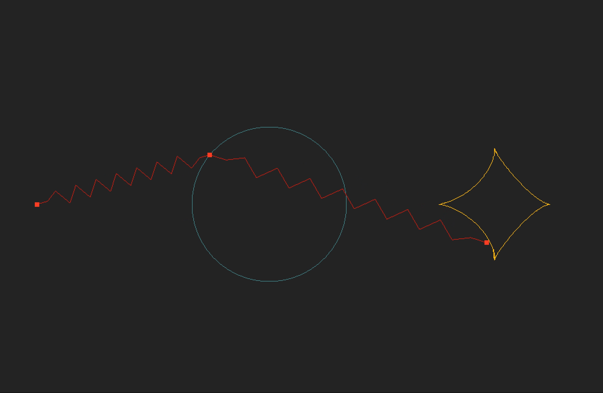

# Zeeman's Catastrophe Machine Simulation

This repo is a simple C++ program that uses OpenGL and GLUT for simulating the
famous mechanical device named after mathematician
Cristopher Zeeman (1925 – 2016). It is a simple example of a dynamical system
with catastrophe behavior.

### How to use
Program can be simply compiled using `make` command. Some commands:
* `s` - Show projection of a catastrophe curve on the control space (plane)
* `1` - Turn on vertical oscillation
* `2` - Turn on circular oscillation
* `q` - Quit

### Catastrophe free oscillation

### Catastrophe oscillation

### Some details

In some way such phenomena is quite counter intuitive, since it shows that it's
possible that a smooth change of input of a differentiable dynamical system can
cause singularity in output. This effect can be explained geometrically looking
at the equilibrium surface of a given system. For more, feel free to contact
and see the reference:
* Arnol'd V.I. - Catastrophe Theory, Second Edition [Springer-Verlag, 1986]
